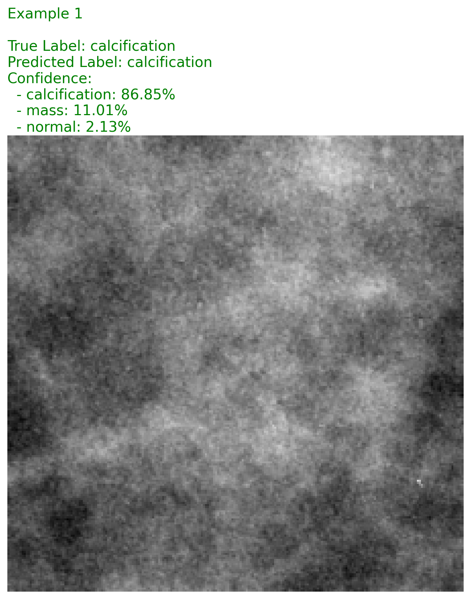
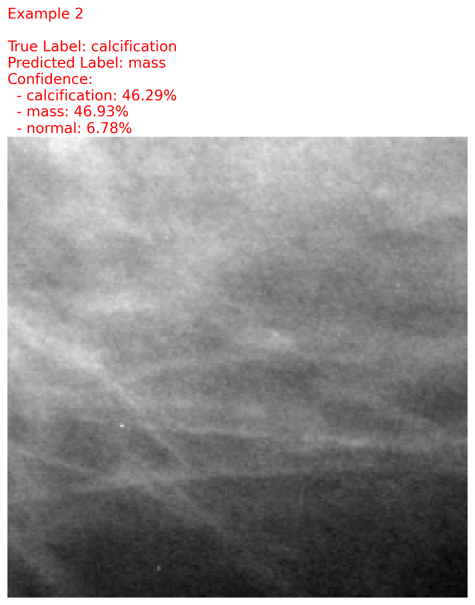
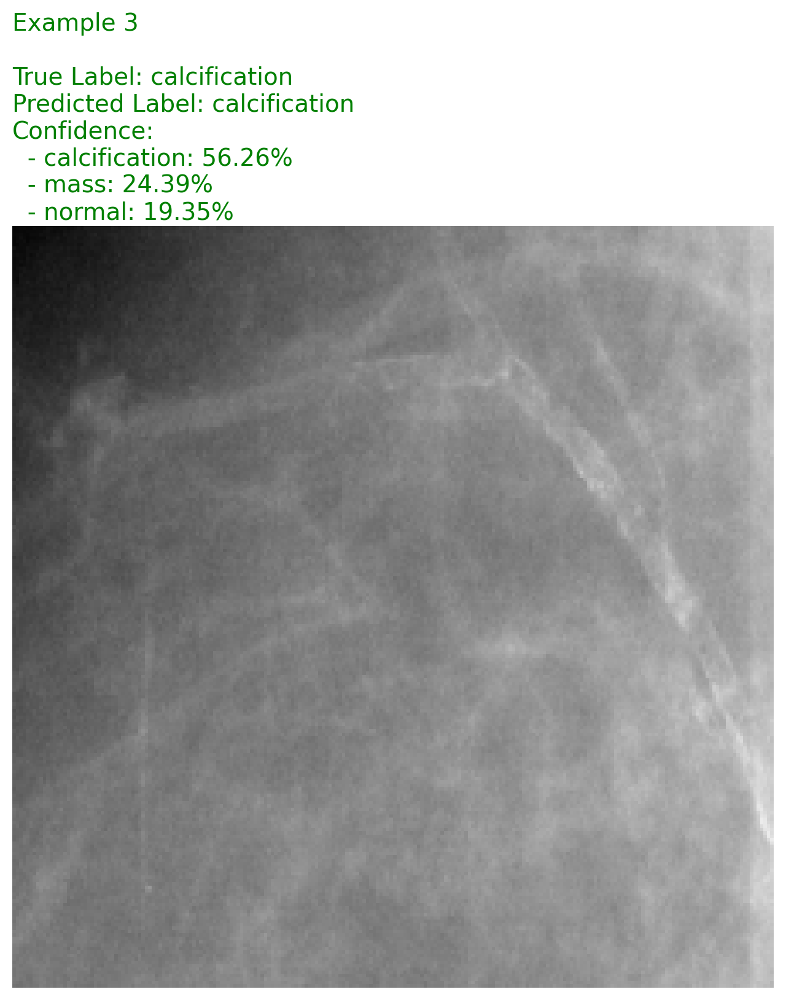
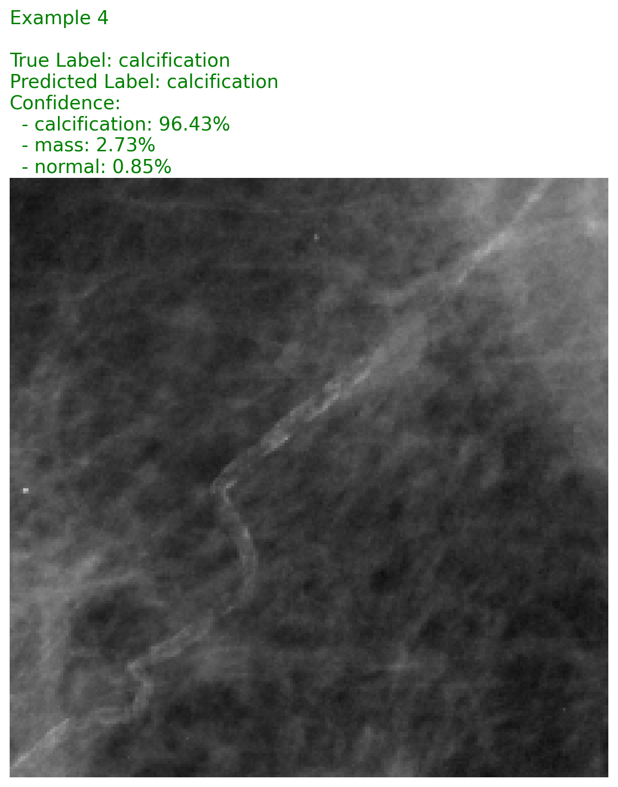
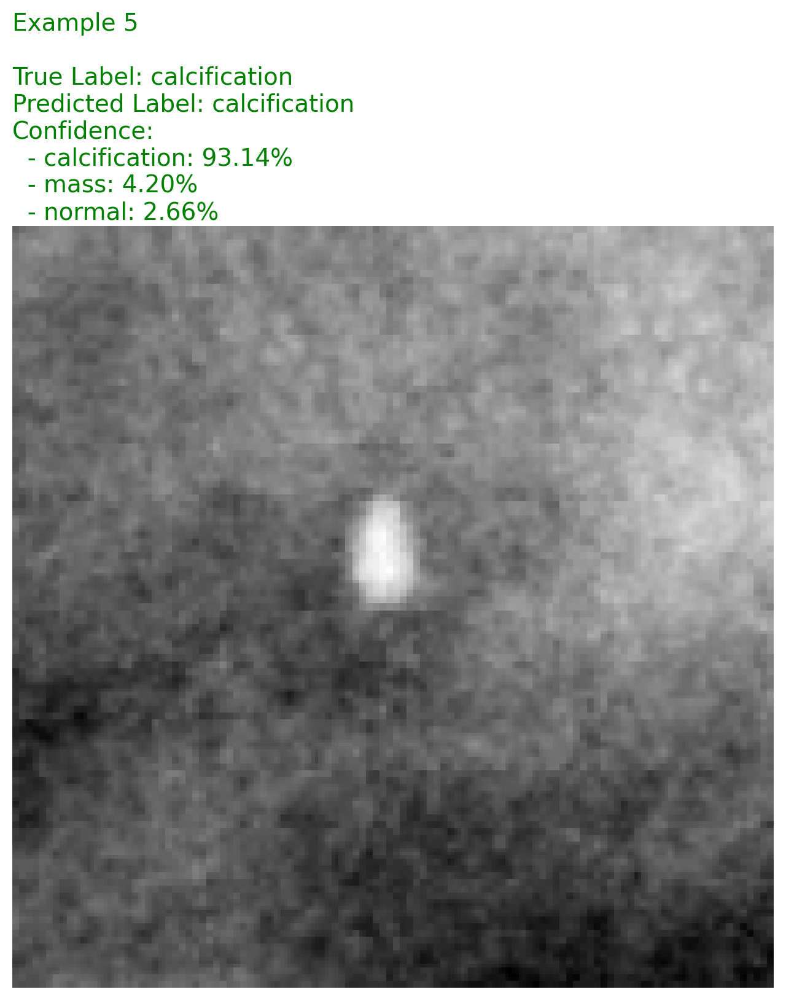
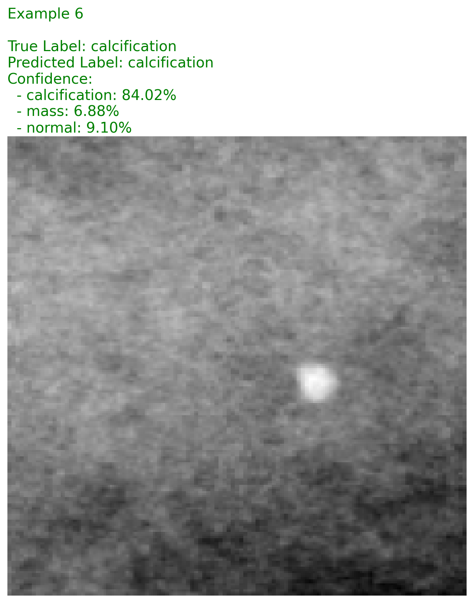

# 🩺 BRACS – Breast Abnormality Classification System

[](https://share.streamlit.io/your-username/your-repo/main/app.py)

🧠 Proof-of-concept deep learning project using the CBIS-DDSM dataset to detect and classify mammogram patches as Mass, Calcification, or Normal. Trained multiple CNN models, fine-tuned the best one, and deployed it as a Streamlit web app for real-time predictions.

## ✨ Features

- 🔬 **Real-time Classification**: Upload mammogram images and get instant predictions.
- 📊 **Model Insights**: View prediction probabilities and confidence scores.
- 🎓 **Educational Tool**: Includes model performance metrics and example results.
- 👤 **User-Friendly Interface**: Built with Streamlit for easy interaction.

## 📦 Installation

1. 📥 Clone the repository:

   ```bash
   git clone https://github.com/your-username/DDSM_Classifier_Dashboard.git
   cd DDSM_Classifier_Dashboard
   ```

2. 🛠️ Install dependencies:

   ```bash
   pip install -r requirements.txt
   ```

3. ▶️ Run the app:
   ```bash
   streamlit run app.py
   ```

## 📖 Usage

- 🌐 Open the app in your browser.
- 📤 Upload a mammogram image in the sidebar.
- 📈 View the classification results and probabilities.

⚠️ **Note**: This is an educational tool and not a substitute for professional medical diagnosis.

## 🤖 Model Details

- 🏗️ **Architecture**: ResNet50-based CNN fine-tuned on CBIS-DDSM dataset.
- 🏷️ **Classes**: Calcification, Mass, Normal.
- 📏 **Input Size**: 224x224 pixels.
- 🎯 **Accuracy**: 92%.

## 📸 Screenshots

### 🖼️ App Logo


### 📋 Classification Report


### 🔄 Confusion Matrix


### 📈 Model Plots


### 🎯 Sample Class Predictions


## 📊 Final Reports

### 📋 Detailed Classification Report

```
CLASSIFICATION REPORT
=======================================
              precision    recall  f1-score   support

calcification       0.81      0.86      0.83       269
         mass       0.89      0.82      0.85       341
       normal       0.99      1.00      0.99       596

    accuracy                           0.92      1206
   macro avg       0.89      0.89      0.89      1206
  weighted avg       0.92      0.92      0.92      1206
```

### 🔄 Confusion Matrix


### 🖼️ Example Predictions








## 📚 Dataset

- 📖 **CBIS-DDSM**: Curated Breast Imaging Subset of DDSM.
- 🔍 Preprocessed patches for abnormality detection.

## 🤝 Contributing

Contributions are welcome! Please open an issue or submit a pull request.

## 📜 License

This project is licensed under the MIT License - see the [LICENSE](LICENSE) file for details.

## ⚠️ Disclaimer

This tool is for educational purposes only. Consult medical professionals for actual diagnoses.
